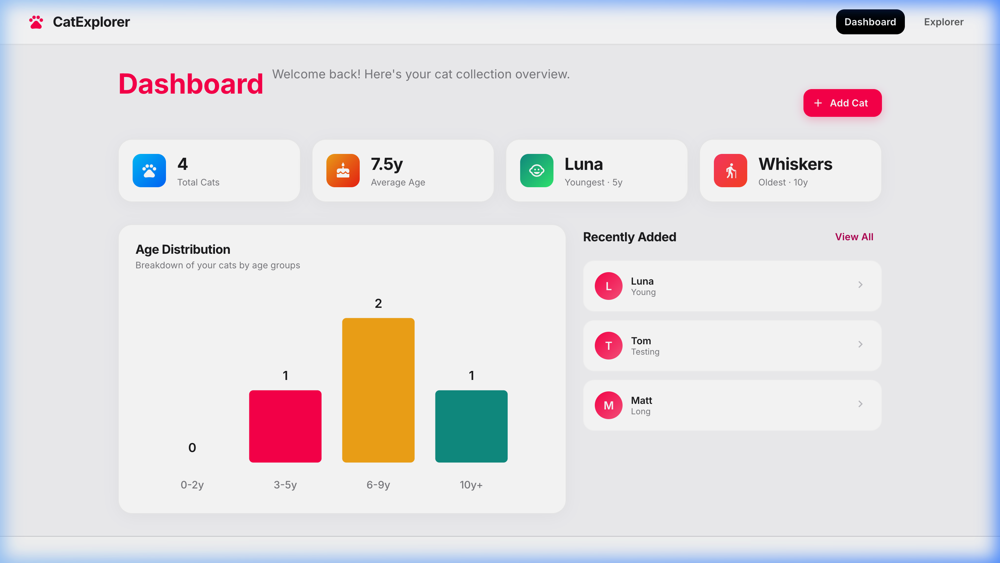
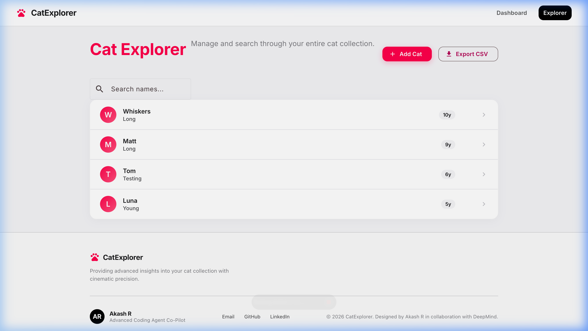
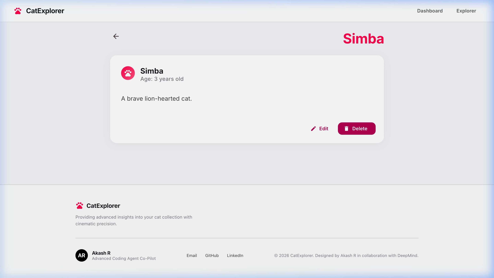

# CatExplorer 🐾

A cinematic, high-fidelity cat management dashboard built with **Angular 21**, **Signals**, and **Zoneless change detection**. This application connects to a high-performance AWS Lambda backend to provide a seamless interface for managing feline diagnostic registries.



## 🚀 Key Features

- **Apple-Style Clean Aesthetic**: Pristine light-themed UI with high-contrast Inter typography and vibrant hot-pink accents.
- **Full CRUD Operations**: Create, read, update, and delete cat records with real-time feedback.
- **Real-time Live Search**: Filter through your cat registry instantly using Angular Signals and RxJS.
- **Interactive Dashboard**: Visualize your cat collection with dynamic charts and key performance indicators.
- **Cinematic Transitions**: Ultra-snappy hover effects and smooth layout transitions utilizing premium cubic-bezier easing.
- **Global Error Handling**: Integrated `MatSnackBar` notifications and confirmation dialogs for destructive actions.

## 📸 App Showcase

### Dashboard & Analytics
The intelligent dashboard provides an instant overview of your feline diagnostics.


### Cat Registry
Manage your entire collection with our high-performance explorer interface.


### In-Depth Details
View comprehensive profiles and diagnostic history for every cat.


### Functional Walkthrough
See the application's core flows in action (Animated WebP):


> [!NOTE]
> The walkthrough is provided in **Animated WebP** format, which is supported by most modern browsers and GitHub. If you strictly require a `.gif` or `.mp4` for your specific environment, you can use an online converter (e.g., CloudConvert or ezgif) to convert the file located at `docs/assets/walkthrough.webp`.


## 🌐 Deployment

This application is optimized for deployment on **Netlify**. A `netlify.toml` file is included in the project root to handle:
- Automated builds via `npm run build`
- API proxying for production (redirecting `/api/*` to the AWS Lambda backend)
- SPA routing (redirecting all paths to `index.html`)

To deploy, simply connect your GitHub repository to Netlify and it will handle the rest!

## 🏗️ Technical Architecture


This project strictly adheres to the latest Angular best practices:

- **Framework**: Angular 21.2.0 (latest stable)
- **Architecture**: 100% Standalone Components (No NgModules)
- **Reactive State**: Pure Angular Signals for state management
- **Performance**: Zoneless change detection enabled via `provideZonelessChangeDetection()`
- **Type Safety**: Strict TypeScript mode with zero usage of `any`
- **UI System**: Angular Material 3 with custom design tokens
- **Proxy Layer**: Integrated local proxy to handle CORS and case-sensitive header injections for the Lambda backend

## 🛠️ Getting Started

### Prerequisites

- **Node.js**: v22+ (LTS recommended)
- **npm**: v11+
- **Angular CLI**: v19+

### Installation

1. Clone the repository:
   ```bash
   git clone https://github.com/[USER]/cat-api-web-app.git
   cd cat-api-web-app/cat-explorer
   ```

2. Install dependencies:
   ```bash
   npm install
   ```

3. Run the development server:
   ```bash
   npm start
   ```
   Navigate to `http://localhost:4200/`. The application will automatically reload if you change any of the source files.

### Backend Proxy Note

The development server is configured to proxy API requests to bypass CORS and inject the required case-sensitive `Content-Type` headers for the AWS Lambda backend. This configuration is located in `src/proxy.conf.json`.

## 🧪 Documentation & Walkthrough

A detailed implementation walkthrough, including verification recordings and screenshots, can be found in the [walkthrough.md](file:///Users/akashr/.gemini/antigravity/brain/6d888b4c-804d-4988-9f70-c4d3ad259eea/walkthrough.md).

## 📄 License

This project is licensed under the MIT License.
